#### 关于vue在浏览器的兼容性

所有支持es5的浏览器有

#### 关于个别组件的兼容
一、[echarts](https://www.echartsjs.com/zh/feature.html)（支持到ie8+）

二、[element-ui](https://github.com/ElemeFE/element)（支持到ie10+）

作者在该[issue](https://github.com/ElemeFE/element/issues/10732)中也回复了

三、[vue-video-player](https://github.com/surmon-china/vue-video-player/issues/130)（支持到ie11+）

vue-video-player 基于[video.js](https://videojs.com/getting-started)封装，vedio.js的支持度如下

四、[screenfull]()

其他js依赖的兼容性与vue一致。

dmp

一、[antd](https://3x.ant.design/docs/react/introduce-cn) (支持ie11+)
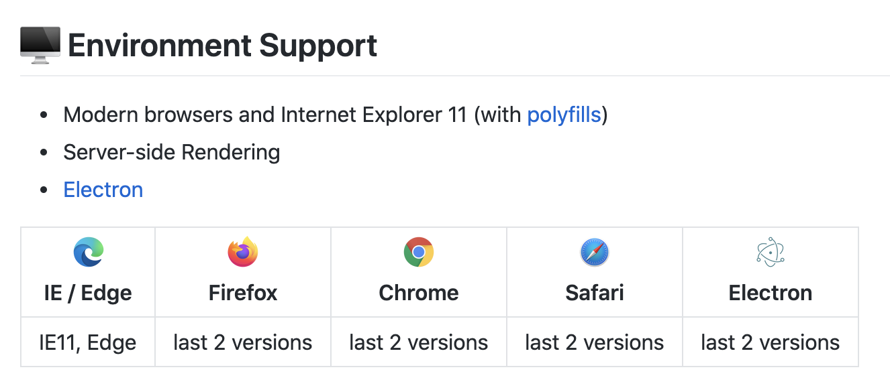

二、[bootstrap](https://getbootstrap.com/docs/3.4/getting-started/#support) (支持ie10+，ie8-9部分支持)
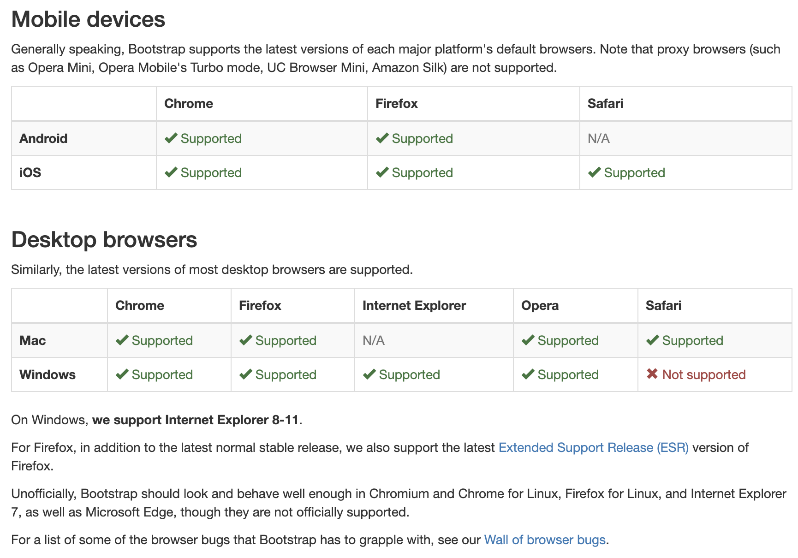
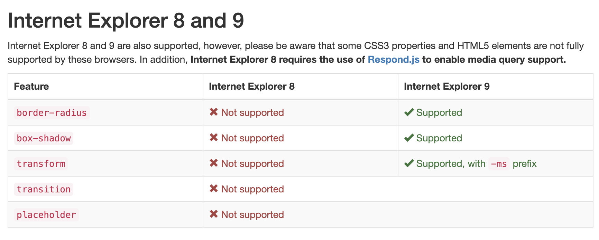

三、[react](https://zh-hans.reactjs.org/docs/react-dom.html#browser-support)（支持ie9+）
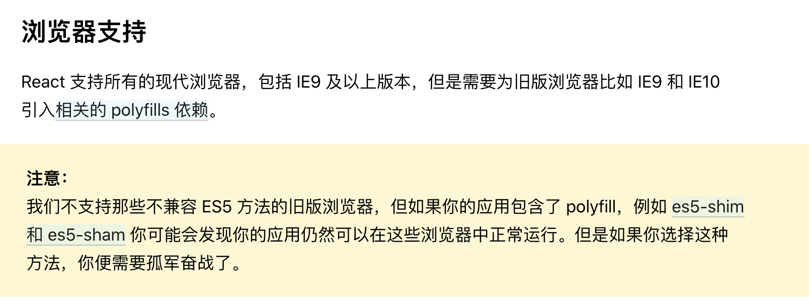

四、[codemirror](https://codemirror.net/)（支持ie8+）
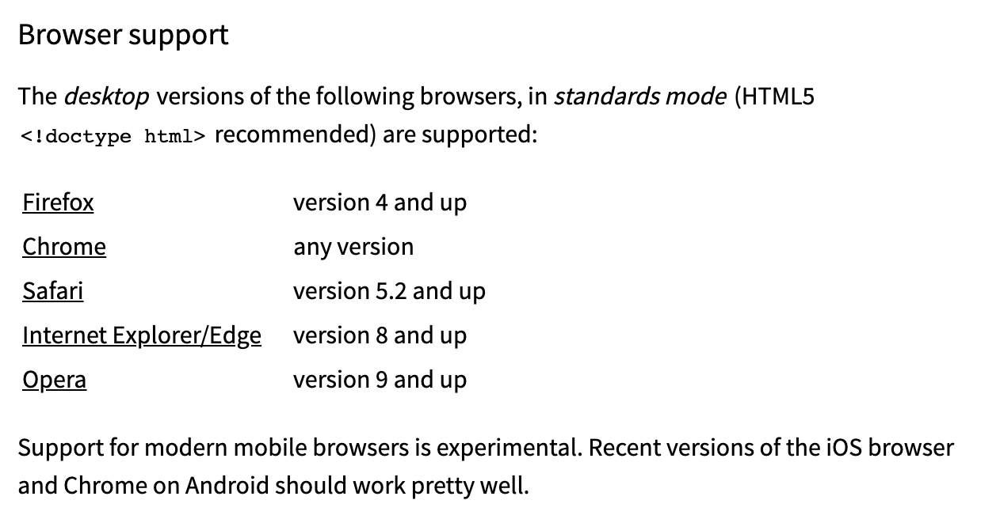

五、[font-awesome](https://fontawesome.com/v4.7.0/get-started/)（支持ie8+）
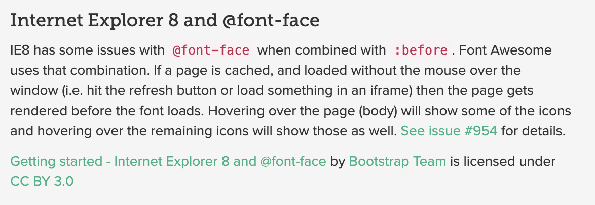

六、[jquery](https://jquery.com/browser-support/)（支持ie9+）
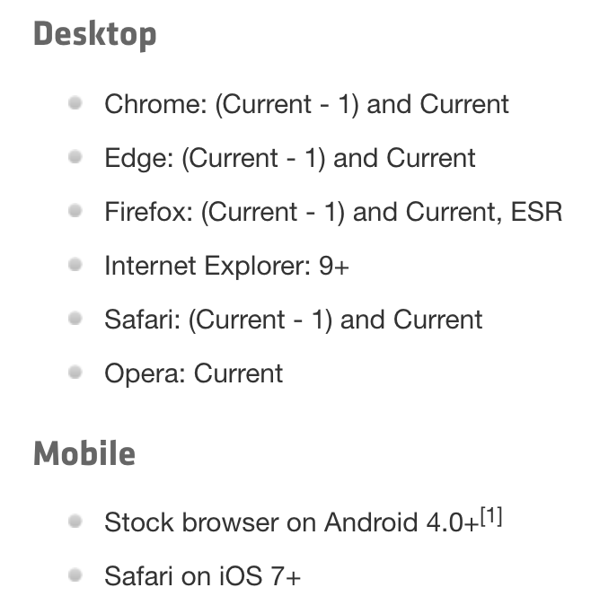

七、[lodash](https://lodash.com/)（支持ie11+）
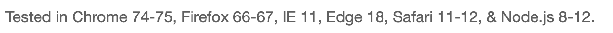

八、[moment](https://momentjs.com/docs/#/use-it/browser/)（支持ie8+）
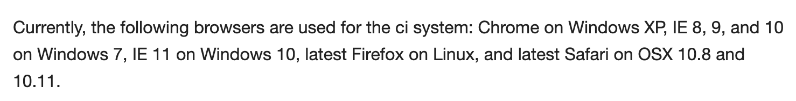

九、[raphael](http://dmitrybaranovskiy.github.io/raphael/)（支持ie6+）
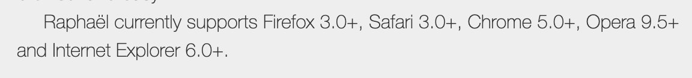

十、[copy-to-clipboard](https://github.com/sudodoki/copy-to-clipboard#readme)（支持ie11+）
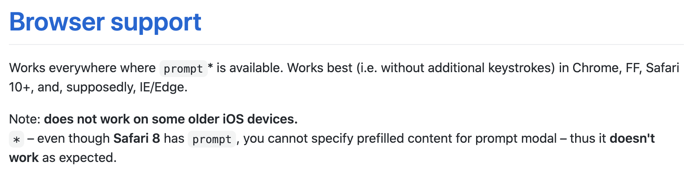